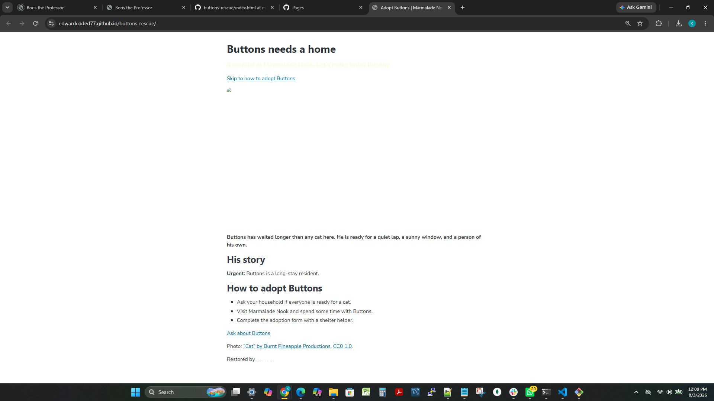
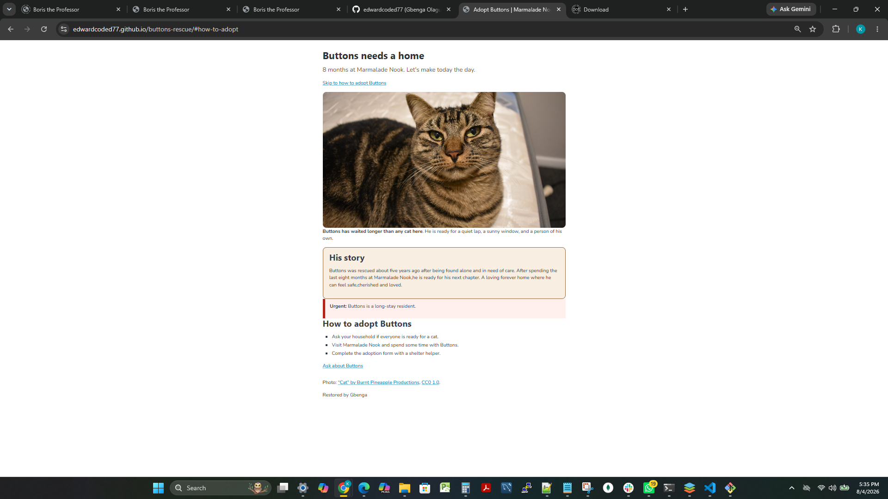

# Buttons Rescue

Buttons was rescued about five years ago after being found alone and in need of care. After spending the last eight months at Marmalade Nook,he is ready for his next chapter.
A loving forever home where he can feel safe,cherished and loved.

## Before and after

## What I fixed

- Fixed the Buttons photo by ensuring the src value matched the correct image file name.
- Added the missing </b> closing tag to fix the paragraph formatting.
- Updated the link href to match the correct ID (#how-to-adopt).
- Fixed the CSS selector to match the 
 element in index.html.
- Added the missing } in the .photo CSS rule so the .urgent styles apply correctly.
- Improved .tagline readability by adjusting the text color for better background contrast.
- Updated the image alt text with a meaningful description for accessibility.
- Added Buttons' rescue story to provide the missing background information.

## Credits

Photo: "Cat" by Burnt Pineapple Productions, CC0 1.0.
Live page:  https://edwardcoded77.github.io/buttons-rescue/
